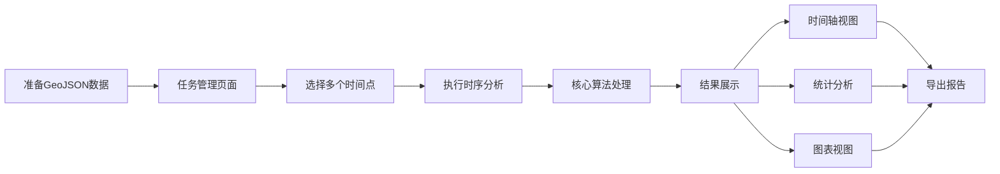

# 时序变化分析功能更新说明

## 🎉 更新概述

本次更新为WebGIS项目增加了完整的**时序变化分析**功能，可以基于不同时间段的GeoJSON作物数据，实现多维度的变化分析和可视化。

**更新日期：** 2025-01-20  
**版本：** v2.0

---

## ✨ 新增功能

### 1. 核心分析引擎

**文件：** `src/utils/temporalAnalysis.js`

**功能特性：**
- 🔍 **智能地块匹配**
  - ID精确匹配（优先）
  - 几何位置匹配（备选）
  - 可配置的匹配阈值
  
- 📊 **时序轨迹构建**
  - 自动追踪每个地块的作物变化
  - 计算变化次数和变化时刻
  - 识别起始和结束作物类型
  
- 📈 **统计分析**
  - 作物转换矩阵
  - 每期作物分布统计
  - 轮作模式识别
  - 变化频率分析

- 💾 **数据导出**
  - CSV格式导出
  - 支持自定义字段
  - 中文编码支持

**核心函数：**
```javascript
// 构建时序轨迹
buildTemporalTrajectories(timePointsData, options)

// 地块匹配
matchFeatures(baseFeatures, targetFeatures, options)

// 分析轮作模式
analyzeRotationPatterns(trajectories)

// 导出CSV
exportToCSV(analysisResult)

// 获取作物名称
getCropName(gridcode)
```

### 2. 增强的可视化组件

#### 2.1 作物转换流向图

**文件：** `src/views/ResultCompare/components/CropTransitionChart.vue`

**功能：**
- 📊 流向条形图展示
- 🎨 渐变色彩效果
- 📋 转换统计信息
- 🔝 TOP转换类型高亮

#### 2.2 作物分布趋势图

**文件：** `src/views/ResultCompare/components/CropDistributionChart.vue`

**功能：**
- 📈 三种显示模式（数量/面积/占比）
- ⏰ 时间点切换
- 🎨 进度条可视化
- 📊 各期对比表格

#### 2.3 轮作模式分析图

**文件：** `src/views/ResultCompare/components/RotationPatternChart.vue`

**功能：**
- 🔄 轮作序列展示
- 📊 频率统计
- 🏆 TOP模式排名
- 📈 可视化条形图

#### 2.4 增强版时序地图视图

**文件：** `src/views/ResultCompare/components/TemporalMapViewEnhanced.vue`

**功能：**
- 🗺️ **三种视图模式**
  - 时间轴视图（交互式地图）
  - 统计分析视图（数据表格）
  - 图表视图（可视化图表）
  
- 🎯 **交互特性**
  - 时间轴滑块
  - 地块悬停提示
  - 快速时间跳转
  - 变化地块筛选
  
- 📤 **导出功能**
  - CSV数据导出
  - 分析报告生成

### 3. 任务管理集成

**更新文件：** `src/views/TaskManagement/index.vue`

**改进：**
- ✅ 使用新的核心算法引擎
- ✅ 更准确的地块匹配
- ✅ 更详细的统计信息
- ✅ 更完整的元数据保存
- ✅ 控制台日志优化

### 4. 结果展示集成

**更新文件：** `src/views/ResultCompare/index.vue`

**改进：**
- ✅ 使用增强版组件
- ✅ 更丰富的可视化效果
- ✅ 更好的用户体验

---

## 📊 技术架构

```
时序变化分析系统
├── 核心层（Core）
│   └── src/utils/temporalAnalysis.js
│       ├── 地块匹配算法
│       ├── 轨迹构建引擎
│       ├── 统计分析模块
│       └── 数据导出功能
│
├── 可视化层（Visualization）
│   └── src/views/ResultCompare/components/
│       ├── TemporalMapViewEnhanced.vue      [主视图]
│       ├── CropTransitionChart.vue          [流向图]
│       ├── CropDistributionChart.vue        [分布图]
│       └── RotationPatternChart.vue         [模式图]
│
├── 业务层（Business）
│   ├── src/views/TaskManagement/index.vue   [任务创建]
│   └── src/views/ResultCompare/index.vue    [结果展示]
│
└── 数据层（Data）
    └── src/stores/analysis.js                [状态管理]
```

---

## 🎯 使用流程



---

## 📝 配置说明

### 作物类型映射

**位置：** `src/utils/temporalAnalysis.js`

```javascript
const CROP_TYPE_MAP = {
  0: '未种植',
  1: '水稻',
  2: '小麦',
  3: '玉米',
  // ... 根据实际情况配置
}
```

### 字段映射

**位置：** `src/views/TaskManagement/index.vue` → `performTemporalAnalysis`

```javascript
const analysisResult = buildTemporalTrajectories(timePointsData, {
  idField: 'Id',        // 地块ID字段
  cropField: 'gridcode', // 作物代码字段
  areaField: 'area'      // 面积字段
})
```

### 匹配参数

**位置：** `src/utils/temporalAnalysis.js` → `matchFeatures`

```javascript
const matches = matchFeatures(baseFeatures, targetFeatures, {
  useId: true,              // 是否使用ID匹配
  idField: 'Id',            // ID字段名
  distanceThreshold: 10     // 几何匹配距离阈值
})
```

---

## 📁 文件清单

### 新增文件

```
src/utils/temporalAnalysis.js                              [核心算法]
src/views/ResultCompare/components/CropTransitionChart.vue [流向图组件]
src/views/ResultCompare/components/CropDistributionChart.vue [分布图组件]
src/views/ResultCompare/components/RotationPatternChart.vue  [模式图组件]
src/views/ResultCompare/components/TemporalMapViewEnhanced.vue [主视图组件]
docs/作物类型配置说明.md                                     [配置文档]
docs/时序变化分析使用指南.md                                 [使用指南]
docs/时序变化分析更新说明.md                                 [更新说明]
```

### 修改文件

```
src/views/TaskManagement/index.vue    [集成新算法]
src/views/ResultCompare/index.vue      [使用新组件]
```

---

## 🚀 性能优化

### 1. 数据处理优化
- ✅ 高效的地块匹配算法
- ✅ 增量式轨迹构建
- ✅ 优化的统计计算

### 2. 渲染优化
- ✅ 虚拟滚动支持
- ✅ 按需加载组件
- ✅ 限制显示数量（可配置）

### 3. 内存优化
- ✅ 及时释放大型对象
- ✅ 使用计算属性缓存
- ✅ 避免重复计算

---

## 🎨 UI/UX 改进

### 视觉设计
- 🎨 现代化卡片布局
- 🎨 渐变色彩方案
- 🎨 流畅的动画效果
- 🎨 响应式设计

### 交互体验
- 🖱️ 直观的时间轴控制
- 🖱️ 悬停显示详细信息
- 🖱️ 快速切换视图
- 🖱️ 一键导出功能

### 信息展示
- 📊 清晰的数据层次
- 📊 多维度统计信息
- 📊 高亮关键数据
- 📊 完整的上下文

---

## 🔒 数据安全

- ✅ 客户端处理，数据不上传
- ✅ localStorage持久化
- ✅ 自动清理临时数据
- ✅ 支持数据备份导出

---

## 🐛 已知问题

1. **大数据量性能**
   - 超过1000个地块时可能出现卡顿
   - 建议分区域分批处理
   
2. **浏览器兼容性**
   - IE浏览器不支持
   - 建议使用Chrome、Edge、Firefox

3. **移动端适配**
   - 移动端体验待优化
   - 建议使用PC端访问

---

## 📅 后续计划

### v2.1（计划中）
- [ ] 支持更多的图表类型
- [ ] 添加热力图展示
- [ ] 支持自定义时间分组
- [ ] 优化移动端体验

### v2.2（计划中）
- [ ] AI辅助分析建议
- [ ] 异常变化智能预警
- [ ] 导出PDF报告
- [ ] 数据对比功能增强

### v3.0（规划中）
- [ ] 实时数据流支持
- [ ] 多用户协作
- [ ] 云端存储集成
- [ ] API接口开放

---

## 📚 文档链接

- 📖 [时序变化分析使用指南](./时序变化分析使用指南.md)
- ⚙️ [作物类型配置说明](./作物类型配置说明.md)
- 🚀 [快速开始](./快速开始.md)
- 📋 [功能使用指南](./功能使用指南.md)

---

## 🙏 致谢

感谢所有参与测试和提供反馈的用户！

---

**如有问题或建议，欢迎反馈！** 😊


